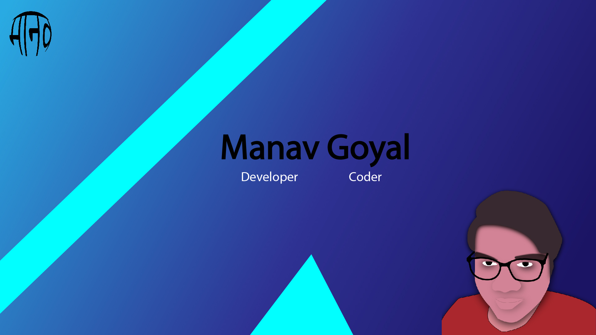

    

<h3 align="center">
Hey there ,   I’m <a href="https://manavapp.herokuapp.com/" target="_blank" rel="noreferrer">Manav Goyal</a> A passionate self-taught full stack web developer from India. My passion for software lies with dreaming up ideas and making them come true with elegant interfaces.
</h3>

# Stats

>)

# Language & Tools

# Connect with Me

